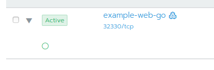

In this lab, we are going to make the freshly deployed application from the last lab available online.

The command `kubectl create deployment` from the last labcreates a pod but no service. A service is another Kubernetes concept which we'll need in order to make our application available online. We're going to do this with the command `kubectl expose`. As soon as we then expose the service itself, it is available online.


## Task:

With the following command we create a service and by doing this we expose our deployment. There are different kinds of services. For this example, we are going to use the [`NodePort`](https://kubernetes.io/docs/concepts/services-networking/service/#nodeport) type and expose port 5000:

```bash
kubectl expose deployment example-web-go --type="NodePort" --name="example-web-go" --port=5000 --target-port=5000 --namespace <NAMESPACE>
```

[Services](https://kubernetes.io/docs/concepts/services-networking/service/) in Kubernetes serve as an abstraction layer, entry point and proxy/load balancer for pods. A Service makes it possible to group and address pods from the same kind.

As an example: If a replica of our application pod cannot handle the load anymore, we can simply scale our application to more pods in order to distribute the load. Kubernetes automatically maps these pods as the service's backends/endpoints. As soon as the pods are ready, they'll receive requests.

{}
The application is not yet accessible from outside, the service is a Kubernetes internal concept. We're going to fully expose the application in the next lab.
{}

Let's have a more detailed look at our service:

```bash
kubectl get services --namespace <NAMESPACE>
```

which gives you an output similar to this:

```bash
NAME             TYPE       CLUSTER-IP    EXTERNAL-IP   PORT(S)        AGE
example-web-go   NodePort   10.43.91.62   <none>        5000:30692/TCP  
```

The `NodePort` number is being assigned by Kubernetes and stays the same as long as the services is not deleted. A NodePort service is rather suitable for infrastructure tools than for public URLs. But don't worry, we are going to do that later too with Ingress mappings that create better readable URLs.

You get additional information by executing the following command:

```bash
kubectl get service example-web-go --namespace <NAMESPACE> -o json
```

```json
{
    "apiVersion": "v1",
    "kind": "Service",
    "metadata": {
        "creationTimestamp": "2019-06-21T06:25:38Z",
        "labels": {
            "app": "example-web-go"
        },
        "name": "example-web-go",
        "namespace": "team1-dockerimage",
        "resourceVersion": "102747",
        "selfLink": "/api/v1/namespaces/team1-dockerimage/services/example-web-go",
        "uid": "62ce2e59-93ed-11e9-b6c9-5a4205669108"
    },
    "spec": {
        "clusterIP": "10.43.91.62",
        "externalTrafficPolicy": "Cluster",
        "ports": [
            {
                "nodePort": 30692,
                "port": 5000,
                "protocol": "TCP",
                "targetPort": 5000
            }
        ],
        "selector": {
            "app": "example-web-go"
        },
        "sessionAffinity": "None",
        "type": "NodePort"
    },
    "status": {
        "loadBalancer": {}
    }
}
```

With the appropriate command you get details from the pod (or any other resource):

```bash
kubectl get pod example-web-go-3-nwzku --namespace <NAMESPACE> -o json
```

{}
First, get all pod names from your namespace with (`kubectl get pods --namespace <NAMESPACE>`) and then replace it in the following command.
{}

The service's `selector` defines, which pods are being used as endpoints. This happens based on labels. Look at the configuration of service and pod in order to find out what maps to what:

Service: 
```bash
kubectl get service <Service Name> --namespace <NAMESPACE> -o json
```

```json
...
"selector": {
    "app": "example-web-go",
},
...
```

Pod:

```bash
kubectl get pod <Pod Name> --namespace <NAMESPACE>
```
```json
...
"labels": {
    "app": "example-web-go",
},
...
```

This link between service and pod can be displayed in an easier fashion with the `kubectl describe` command:

```bash
kubectl describe service example-web-go --namespace <NAMESPACE>
```

```
Name:                     example-web-go
Namespace:                philipona
Labels:                   app=example-web-go
Annotations:              <none>
Selector:                 app=example-web-go
Type:                     NodePort
IP:                       10.39.240.212
Port:                     <unset>  5000/TCP
TargetPort:               5000/TCP
NodePort:                 <unset>  30100/TCP
Endpoints:                10.36.0.8:5000
Session Affinity:         None
External Traffic Policy:  Cluster
Events:
  Type    Reason                Age    From                Message
  ----    ------                ----   ----                -------
  Normal  EnsuringLoadBalancer  7m20s  service-controller  Ensuring load balancer
  Normal  EnsuredLoadBalancer   6m28s  service-controller  Ensured load balancer
```

{}
Service IP addresses stay the same for the duration of the service's life span.
{}

Open `http://[NodeIP]:[NodePort]` in your Browser. 
You can use any NodeIP as the Service is exposed on all Nodes using the same NodePort. Use `kubectl get nodes -o wide` to display the IP's (INTERNAL-IP) of the available nodes.

```bash 
kubectl get node -o wide
```

```
NAME         STATUS   ROLES                      AGE    VERSION   INTERNAL-IP     EXTERNAL-IP   OS-IMAGE             KERNEL-VERSION      CONTAINER-RUNTIME
lab-1   Ready    controlplane,etcd,worker   150m   v1.17.4   5.102.145.142   <none>        Ubuntu 18.04.3 LTS   4.15.0-66-generic   docker://19.3.8
lab-2   Ready    controlplane,etcd,worker   150m   v1.17.4   5.102.145.77    <none>        Ubuntu 18.04.3 LTS   4.15.0-66-generic   docker://19.3.8
lab-3   Ready    controlplane,etcd,worker   150m   v1.17.4   5.102.145.148   <none>        Ubuntu 18.04.3 LTS   4.15.0-66-generic   docker://19.3.8
```

{}
{}
You can also use the Rancher WebGUI to open the exposed application in your Browser. The direkt link is shown on your *Resources / Workload* Page in the tab *Workload*. Look for your namespace and the deployment name. The Link looks like `31665/tcp`.



 Or go to the *Service Discovery* Tab and look for your service Name. The Link there looks the same and is right below the service name.

{}
{}


## Task: Create an ClusterIP Service with an Ingress

There's a second option to make a service accessible from outside: Use an ingress router.

In order to switch the service type, we are going to delete the NodePort service that we've created before:

```bash
kubectl delete service example-web-go --namespace=<NAMESPACE>
```
Now we create a service with type [ClusterIP](https://kubernetes.io/docs/concepts/services-networking/service/#publishing-services-service-types):

```bash
kubectl expose deployment example-web-go --type=ClusterIP --name=example-web-go --port=5000 --target-port=5000 --namespace <NAMESPACE>
```

In order to create the ingress resource, we first need to create the file `ingress.yaml` and change the host variable to match your environment.

```yaml
apiVersion: extensions/v1beta1
kind: Ingress
metadata:
  name: example-web-go
spec:
  rules:
  - host: web-go-<NAMESPACE>.k8s-techlab.puzzle.ch
    http:
      paths:
      - path: /
        backend:
          serviceName: example-web-go
          servicePort: 5000
```

After creating the ingress file, we can apply it:
```bash
kubectl create -f ingress.yaml --namespace <NAMESPACE>
```
Afterwards we are able to access our freshly created service at `http://web-go-<NAMESPACE>.k8s-techlab.puzzle.ch`


## Additional Task for Fast Learners

Have a closer look at the created resources with

```bash
kubectl get [RESOURCE TYPE] [NAME] -o json
```

and 

```bash
kubectl describe [RESOURCE TYPE] [NAME]
```
from your namespace `<NAMESPACE>` and try to understand them.
